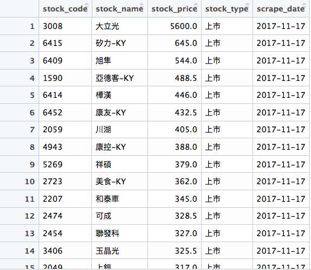
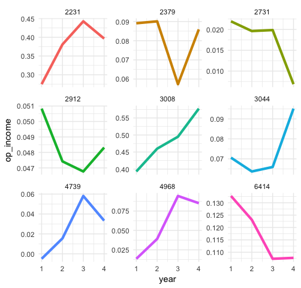

# 關於講師

## 關於我

```js
var yaoJenKuo = {
	"name": "郭耀仁",
	"organization": "Kyosei.ai",
	"loves": [
		"Data Science",
		"Marathon",
		"Ping pong"
	]
};
```

---

<a href="http://www.learn-r-the-easy-way.tw/" target="_blank"></a>

---

<a href="https://ithelp.ithome.com.tw/2017ironman/8th_winner" target="_blank"></a>

## 講師經歷

- 台大資工系統訓練班（2016 - 現在）
- 2017 資料科學年會講師
- 國立台北商業大學（2017 秋）
- 玉山商業銀行（2017 夏）

# Could that data BE any tidier?

---


Google 圖片

---


Google 圖片

---

> Data Scientist: The Sexiest Job of the 21st Century.

[Harvard Business Review OCTOBER 2012 ISSUE](https://hbr.org/2012/10/data-scientist-the-sexiest-job-of-the-21st-century)

# 大數據究竟有多大？

## 個人偏好

通常我喜歡說資料科學 :)

## 「規模」只是其中一個特徵

- Volume（規模）
- Variety（多樣）
- Velocity（即時）
- Veracity（雜亂）

## 資料科學的範疇

- 資料來源與儲存
- 資料處理
- 資料視覺化
- 機器學習
- 高效能運算

## 雨後春筍的技術生態系


# Data-driven Decision

## Data-driven Decision 的浪潮

資料科學一直都在，只是怎麼被大家接收而已

- Statistical analytics
- Business intelligence
- Marketing science
- ...etc.

## 銀行實務

- 信用卡與信貸的審核拿捏
- 房屋的鑑價
- 企業的信用評等
- ...etc.

## 零售實務

- 上架費用定價
- 購物籃分析
- 折扣試算
- ...etc.

---


---


## Target

[How Target Figured Out A Teen Girl Was Pregnant Before Her Father Did](https://www.forbes.com/sites/kashmirhill/2012/02/16/how-target-figured-out-a-teen-girl-was-pregnant-before-her-father-did/#383ea48a6668)

Forbes, FEB 16, 2012

## Wal-Mart

[Diaper-beer syndrome](https://www.forbes.com/forbes/1998/0406/6107128a.html#4cc8513a6260)

Forbes, APR 6, 1998

---

任何一個 data-drive decision made 都是漂亮的**大數據**行銷應用

## 大數據行銷應用趨勢

- 數位廣告投放
- 跨螢廣告投放
- 個人化 STP
- 即時回饋

# 資料科學的程式語言

---

[The 2017 Top Programming Languages](https://spectrum.ieee.org/computing/software/the-2017-top-programming-languages)

## 在資料科學領域獨領風騷的 R 語言

> For R (a domain specific language for data science) to rank in the 6th. Other data-oriented languages appear in the Top 50 rankings, including Matlab (#15), SQL (#23), Julia (#31) and SAS (#37).

## R 語言的二三事

- 以 S 語言為基礎
- 由奧克蘭大學的 Ross Ihaka 與 Robert Gentleman 所創造
- 高階的直譯式語言

## R 語言的特性

- 免費
- 開放
- 高市佔率
- 跨平台
- 彈性大

## 容易建立的開發環境

- 主程式
    - [CRAN](https://cran.r-project.org/)
- 整合開發環境
    - [RStudio](https://www.rstudio.com/products/rstudio/download/)

# 可以用 R 語言做什麼事情

## 建立一個選股策略

[財務自由的世界：財務分析就是一場投資的戰爭](http://www.books.com.tw/products/0010562279?utm_source=cmoney&utm_medium=ap-books&utm_content=recommend&utm_campaign=ap-201410)

---



---



## 快速自動化處理資料


---


## 建立一個資料科學作品集

```bash
mkdir blogdown_project
```

---

```r
setwd("~/blogdown_project")
blogdown::new_site()
blogdown::serve_site()
```

---


---


## 使用其他的主題模板

```r
blogdown::new_site(theme = "gcushen/hugo-academic")
```

# 動手安裝！

# {data-background="http://www.onepiecegold.com/wp-content/uploads/2016/03/AuML130.jpg"}

## 深入淺出

- 基礎
- 應用
- 專案

## 基礎

- 變數類型
- 資料結構
- 流程控制
- 迴圈
- 自訂函數

## 應用

- 資料載入
- Base Plotting System
- ggplot2
- RMarkdown
- %>% 運算子與 dplyr 套件
- 文字函數與正規表達式
- rvest 套件
- caret 套件

## 專案

- 解決工作上的問題
- 建立作品集

# 置入性行銷

## 輕鬆學習 R 語言

[博客來](http://www.books.com.tw/products/0010763975)

[天瓏網路書店](https://www.tenlong.com.tw/products/9789864764822)

## Udemy 教學影片

[R 語言輕鬆學習：基礎篇](https://www.udemy.com/learn-r-the-easy-way-1/?couponCode=LEARNR)

## 和我聯絡

<tony@kyosei.ai>