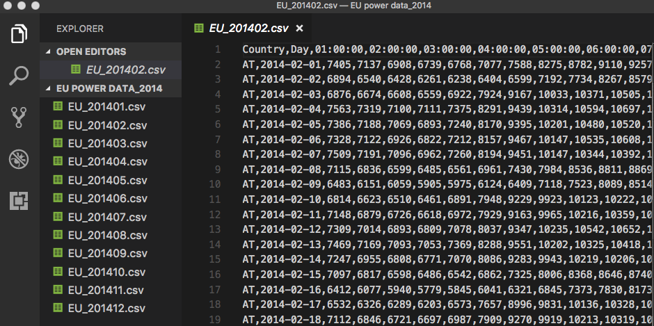
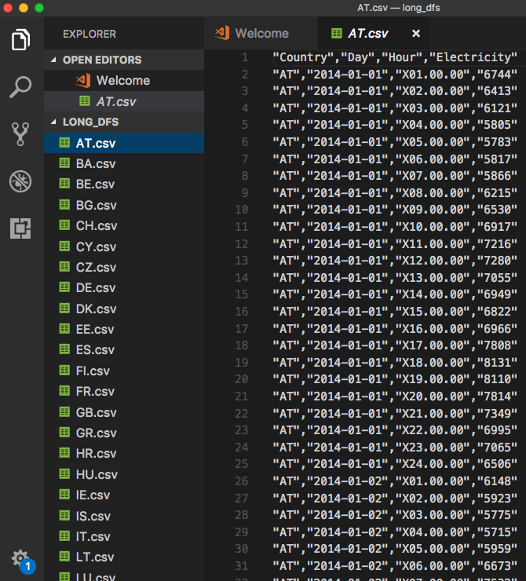
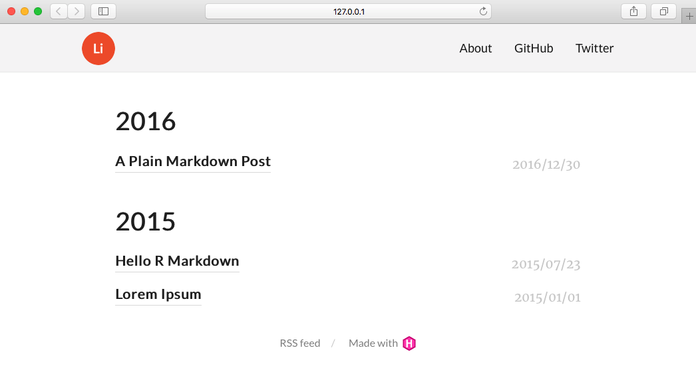
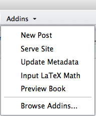

## 投影片連結

http://yaojenkuo.io/tech_talks/map_of_learning_r

# 關於講師

## 關於我

```js
var yaoJenKuo = {
	"name": "郭耀仁",
	"organization": "Kyosei.ai",
	"loves": [
		"Data Science",
		"Marathon",
		"Ping pong"
	]
};
```

---

<a href="http://www.learn-r-the-easy-way.tw/" target="_blank"></a>

---

<a href="https://ithelp.ithome.com.tw/2017ironman/8th_winner" target="_blank"></a>

---

- 台大資工系統訓練班（2016 - 現在）
- 2017 資料科學年會講者
- 國立台北商業大學（2017 秋）
- 玉山商業銀行（2017 夏）

# Could that data BE any tidier?

---


Google 圖片

---


Google 圖片

---

> Data Scientist: The Sexiest Job of the 21st Century.

[Harvard Business Review OCT, 2012](https://hbr.org/2012/10/data-scientist-the-sexiest-job-of-the-21st-century)

## 資料科學的範疇

- 資料技術
- 視覺化
- 機器學習
- 高效能運算

## 雨後春筍般的技術生態系


# 資料科學的程式語言

---

[The 2017 Top Programming Languages](https://spectrum.ieee.org/computing/software/the-2017-top-programming-languages)

## 在資料科學領域獨領風騷的 R 語言

> For R (a domain specific language for data science) to rank in the 6th. Other data-oriented languages appear in the Top 50 rankings, including Matlab (#15), SQL (#23), Julia (#31) and SAS (#37).

## R 語言的二三事

- 以 S 語言為基礎
- 由奧克蘭大學的 Ross Ihaka 與 Robert Gentleman 所創造
- 高階的直譯式語言

## R 語言的特性

- 免費
- 開放
- 高市佔
- 跨平台
- 彈性大

## 容易建立的開發環境

- 主程式
    - [CRAN](https://cran.r-project.org/)
- 整合開發環境
    - [RStudio](https://www.rstudio.com/products/rstudio/download/)

# R vs. Python

## 我推薦都要學

> Both languages have a lot of similarities in syntax and approach, and you can’t go wrong with one, the other, or both. [Vik Paruchuri](https://www.dataquest.io/blog/python-vs-r/)

## 問自己幾個問題

- 有沒有寫過程式
- 喜歡函數型或物件導向編程
- 以什麼應用為主
    - 統計分析
    - 視覺化
    - 深度學習
    - 網站後端建置資料科學系統

# 究竟可以用來做什麼事情

## 建立一個選股策略

[財務自由的世界：財務分析就是一場投資的戰爭](http://www.books.com.tw/products/0010562279?utm_source=cmoney&utm_medium=ap-books&utm_content=recommend&utm_campaign=ap-201410)

## 上市公司股價前一百

```{r echo=FALSE}
df <- read.csv("data/top_100.csv", stringsAsFactors = FALSE)
df
```

## 最後選擇標的

```{r echo=FALSE}
library(tidyr)

res <- read.csv("data/result.csv", stringsAsFactors = FALSE)
res
```

## 看一下營業收益率

```{r echo = FALSE}
source("~/stock_strategy_huang/plot_op_income.R")
plot_op_income(res)
```

## 自動化處理資料



---



---

```{r echo=FALSE, message=FALSE}
library(ggplot2)
library(dplyr)

long_df_c <- read.csv("~/yaojenkuo.github.io/tech_talks/data/eu_elec_data.csv", stringsAsFactors = FALSE)
#long_df_c$DayHour <- as.POSIXct(long_df_c$DayHour)
long_df_c$Day <- as.Date(long_df_c$Day)
long_df_c$Month <- format(long_df_c$Day, "%m")
long_df_c$Electricity <- as.numeric(long_df_c$Electricity)
summarized_long_df_c <- long_df_c %>%
  group_by(Country, Month) %>%
  summarize(sum_elec = sum(Electricity, na.rm = TRUE))
ggplot(summarized_long_df_c, aes(x = Month, y = sum_elec, color = Country)) +
  geom_line(group = 1) +
  facet_wrap(~ Country, nrow = 6, scales = "free") +
  theme(legend.position="none")
```

## 建立一個互動圖表

```{r echo = FALSE, message=FALSE}
library(plotly)
library(gapminder)

p <- gapminder %>%
  plot_ly(
    x = ~gdpPercap, 
    y = ~lifeExp, 
    size = ~pop, 
    color = ~continent, 
    frame = ~year, 
    text = ~country, 
    hoverinfo = "text",
    type = 'scatter',
    mode = 'markers'
  ) %>%
  layout(
    xaxis = list(
      type = "log"
    ),
    yaxis = list(
      type = "log"
    )
  ) %>% 
  animation_button(
    x = 1, xanchor = "right", y = 0, yanchor = "bottom"
  ) %>%
  animation_slider(
    currentvalue = list(prefix = "YEAR ")
  )
p
```

## 建立一個作品集網站

```bash
mkdir blogdown_project
```

---

```r
setwd("~/blogdown_project")
blogdown::new_site()
blogdown::serve_site()
```

---



---



## 使用其他的主題模板

```r
blogdown::new_site(theme = "gcushen/hugo-academic")
```

# Live Demo {data-background="img/man-working-on-laptop-with-coffee-mug-in-background.jpg"}

# {data-background="http://www.onepiecegold.com/wp-content/uploads/2016/03/AuML130.jpg"}

## 談談自己的案例

## 不一樣的學習起點

[Tidyverse：R 語言學習之旅的新起點](https://medium.com/datainpoint/tidyverse-r-%E8%AA%9E%E8%A8%80%E5%AD%B8%E7%BF%92%E4%B9%8B%E6%97%85%E7%9A%84%E6%96%B0%E8%B5%B7%E9%BB%9E-3b01ca6a348c)

## 深入淺出

- 基礎
- 應用
- 專案

## 基礎

- 變數類型
- 資料結構
- 流程控制
- 迴圈
- 自訂函數

## 應用

- 資料載入
- Base Plotting System
- ggplot2
- 文字函數與正規表達式
- rvest 套件
- caret 套件

## 專案

- 解決工作上的問題
- 建立作品集
- [面試](http://yaojenkuo.io/uber)

# 我經營的學習資源

## [台大資工系統訓練班](https://train.csie.ntu.edu.tw/train/teacher.php?id=103)

## 輕鬆學習 R 語言

[博客來](http://www.books.com.tw/products/0010763975)

[天瓏網路書店](https://www.tenlong.com.tw/products/9789864764822)

## Udemy 教學

[R 語言輕鬆學習：基礎篇](https://www.udemy.com/learn-r-the-easy-way-1/?couponCode=LEARNR)

## Medium

[DataInPoint](https://medium.com/datainpoint)

---

> 毋免驚，咱寬寬仔行 。

[滅火器，海上的人](https://youtu.be/u3cKrp96i_M)

## 和我聯絡

<tony@kyosei.ai>